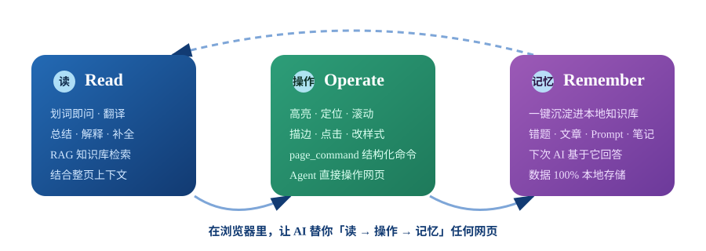

<p align="center">
  
</p>

# RecallFlow

**浏览器里的统一 AI 助手** —— 让 AI 替你 **读 → 操作 → 记忆** 任何网页，帮你在信息过载的浏览器里高效工作。

[](LICENSE)
[](https://www.microsoft.com/edge)
[](manifest.json)
[](https://github.com/marioyyds/RecallFlow)

---

## 为什么是 RecallFlow？

浏览器是你工作的**主要入口**——刷题、读文档、查资料、写代码，你每天要主动涉猎海量信息。信息过载的解法不是「收藏得更多」，而是让 AI 帮你把「读 → 理解 → 用起来」的每一步都变快。

RecallFlow 把浏览器变成一个「**AI 之手**」，开箱即用：

| 一环 | 它替你做什么 |
| --- | --- |
| **读 (Read)** | 划选任意文字即问：翻译、解释、总结、补全，回答自动结合整页上下文，并用 RAG 检索你的历史收藏 |
| **操作 (Operate)** | AI 能直接对网页执行结构化命令：高亮、定位、滚动、描边、点击、改样式——不再只是「读」，而是「干活」 |
| **记忆 (Remember)** | 高亮的关键句、整理出的要点，一键沉淀进本地知识库；下次 AI 会基于它回答 |



**核心原则：隐私优先。** 数据保存在本地 `chrome.storage.local`，唯一外连是你自配的 DeepSeek API Key——知识库是你的私人记忆，不是平台的资产。

## 功能总览

### 读 —— 划词 AI 助手

- **划词悬浮**：选中任意文字出现「RecallFlow」气泡，点击展开对话
- **自由指令**：不限定固定操作（「翻译成英文」「解释这段代码」「优化并补全」「写一份总结」），AI 基于选中文本执行
- **多轮对话**：聊天流展示、可连续追问、记住上下文、自动保存、可一键清空
- **结合整页内容**：回答自动参考当前网页正文（可在设置里开关）
- **RAG 知识库检索**：自动把相关知识库条目作为上下文（可在设置里开关）
- **中断生成**：流式回复过程可「停止」，已生成内容保留
- **对话撤销**：可撤销某条指令及其后续回答，再从此前上下文继续
- **对话快捷语句**：提供「总结全文」「翻译成中文」等快捷按钮，可自定义

### 操作 —— 页面命令系统（Agent 控制网页 DOM）

Agent 可通过 `page_command` 工具对当前网页执行结构化命令（需审批），也可由用户直接触发：

| 命令 | 说明 |
| --- | --- |
| `highlight` | 高亮匹配文本（`text`）或元素（`selector`），不改动页面 DOM |
| `clear_highlights` | 清除高亮 / 描边 / 临时样式 |
| `scroll_to` | 滚动到目标文本/元素，或指定 `top`/`left` 坐标 |
| `scroll_by` | 按 `x`/`y` 偏移滚动 |
| `outline` | 用边框描边标注目标元素 |
| `set_style` | 临时修改目标元素样式（可设 `duration` 自动还原） |
| `click` | 点击目标元素 |
| `get_text` | 读取目标元素的文本 |

- **AI 路径**：在对话里说「高亮这段文字 / 跳到那个标题 / 把这个按钮标出来」，Agent 会调用 `page_command`。
- **用户路径 API**：`chrome.runtime.sendMessage({ type: 'pageCommand', command, params })`，后台转发到当前活动标签页。
- **工具审批**：增删知识库、打开/抓取网页、页面命令、调用 MCP 工具前会暂停确认（可在设置关闭）。

### 记忆 —— 本地知识库

| 类型 | 说明 |
| --- | --- |
| `算法错题` | 打开 LeetCode / 牛客 / 洛谷等题目页自动识别，标记错题星级 |
| `技术文章` | 剪藏博客、论文、文档链接 |
| `AI·Prompt` | 收藏 AI 工具、提示词、优质对话 |
| `笔记想法` | 不依赖网页，手动写笔记 |

- **星级分级**：`★☆☆ 一般 / ★★☆ 重点 / ★★★ 高频`
- **自定义标签**：逗号分隔打标签，支持按标签筛选
- **统计与排序**：总数 + 各星级统计卡片，多维排序
- **完整管理页**：类型 Tab、标签筛选、全文搜索、内联编辑、JSON 导入导出
- **深色模式**：自动跟随系统；**数据迁移**：旧版「算法错题集」数据自动迁移
- **Agent 可读可写**：AI 能检索、查看、新增、删除知识库条目

### 扩展 —— 接入 MCP 服务器

Agent 可作为 **MCP 客户端**连接远程 MCP 服务器（Streamable HTTP），自动加载其工具（工具名以 `mcp__` 开头），从而访问文件系统、联网抓取、Notion 等任意外部能力。

- 设置页「MCP 服务器」卡片：填写 `标识`(英文)、`URL`(如 `https://host/mcp`)、可选 `Bearer Token`，保存即可。
- 每次对话 Agent 会按需连接并拉取工具清单（缓存 5 分钟），在工具调用循环里统一调度内置与 MCP 工具。
- **重要**：MV3 跨域限制要求把每个 MCP 服务器的源加入 `manifest.json` 的 `host_permissions`（如 `"https://host/*"`），否则后台无法发起请求。

## 安装方法 (Edge)

1. 打开 Edge，地址栏输入 `edge://extensions/`
2. 打开右上角「开发人员模式」开关
3. 点击「加载解压缩的扩展」
4. 选择本目录 `bookmark-sorter` 文件夹

## 首次配置

1. 点击插件图标 → 弹窗底部「设置」，或右键插件图标 →「选项」
2. 填入 DeepSeek API Key（在 [platform.deepseek.com](https://platform.deepseek.com) 申请）
3. 按需调整模型（默认 `deepseek-chat`）、翻译目标语言、RAG、Agent 工具审批与快捷语句
4. 保存即可使用 AI 功能；**不配置 Key 也不影响**知识库的收录与检索

## 使用

| 场景 | 操作 |
| --- | --- |
| 快速收录 | 打开网页 → 点工具栏图标 → 选类型/星级 → 填标签备注 → 添加 |
| 手动笔记 | 管理页点「新建笔记」 |
| 划词 RecallFlow | 选中网页文字 → 点「RecallFlow」气泡 → 输入任意指令执行 |
| AI 操作网页 | 在对话里说「高亮这段文字 / 跳到那个标题 / 把这个按钮标出来」 |
| 知识库查询 | 划词后输入问题，开启 RAG 后 AI 结合你的收藏回答；直接问「知识库有什么内容」可查看全部条目 |

## 项目结构

```
bookmark-sorter/
├── manifest.json           # MV3 清单（module SW + 内容脚本动态 import）
├── background.js           # Service Worker 入口：AI 请求 / Agent 编排 / 消息转发
├── content.js              # 内容脚本入口：动态 import() 加载 lib/ 模块
├── popup.js / options.js / manager.js   # 各页面 ES Module 入口
├── lib/
│   ├── shared/             # 跨层基础：常量 / 工具 / 存储 / 设置 / RAG
│   │   ├── constants.js    # 类型、平台、星级、数据版本
│   │   ├── utils.js        # 文本/HTML/排序/toast 等工具函数
│   │   ├── store.js        # 知识库 CRUD 与旧版数据迁移
│   │   ├── settings.js     # AI 设置默认值与读取
│   │   └── rag.js          # RAG 检索、引用元数据、AI 消息构建
│   ├── assistant/          # AI 编排层：模型 / 工具 / MCP / Agent 循环
│   │   ├── llm.js          # DeepSeek（OpenAI 兼容）调用与重试
│   │   ├── tools.js        # 内置工具声明与执行（含 page_command）
│   │   ├── mcp.js          # MCP 客户端（Streamable HTTP）
│   │   └── agent.js        # Agent 主循环 + 工具审批
│   └── page/               # 页面层：正文 / 引用定位 / 命令 / 对话 UI
│       ├── page-text.js    # 网页正文提取
│       ├── citation.js     # 字符级引用定位 + 高亮浮层
│       ├── commands.js     # 页面命令系统（8 种命令）
│       └── chat.js         # 悬浮按钮 / 气泡 / 对话面板 UI
├── docs/assets/            # 文档配图 + 插件与仓库 Logo
```

## License

[](LICENSE)
